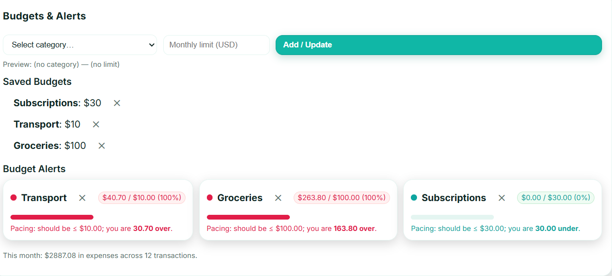

# Finance Tracker — Spring Boot + React + **Ollama** (player-service style)

**What:** CRUD + search for transactions, monthly totals, and an **AI insight** line powered by **Ollama** (local LLM).  
**Stack:** Java 17 • Spring Boot 3 • JPA • H2 • React + TypeScript + Vite • Axios • Ollama4j

## Run locally (Windows / IntelliJ friendly)

1) Start backend (in IntelliJ or Terminal)
   - Open `backend` as a Maven project.
   - Run `FinanceTrackerApplication.java` (port **8080**).

2) Start frontend
```bash
cd frontend
npm i
npm run dev   # http://localhost:5173
```

3) (Optional) Use Ollama for AI
```bash
ollama pull llama3.1:8b
ollama run llama3.1:8b
```
If Ollama isn't running, the app falls back to a rule-based summary.

## REST APIs
- `GET /api/tx?q=&from=&to=&category=` — list/search transactions
- `GET /api/tx/{id}` — get by id
- `POST /api/tx` — create
- `DELETE /api/tx/{id}` — delete
- `GET /api/tx/summary?month=YYYY-MM` — totals by category
- `GET /api/tx/insights?month=YYYY-MM` — AI summary (Ollama → fallback)

## Seed data
`transactions.csv` preloads sample data into **H2** (in-memory).

## Screenshots

**Home (Light)**  


**Home (Dark)**  


**Monthly Summary (Chart)**  


**Budgets & Alerts**  

